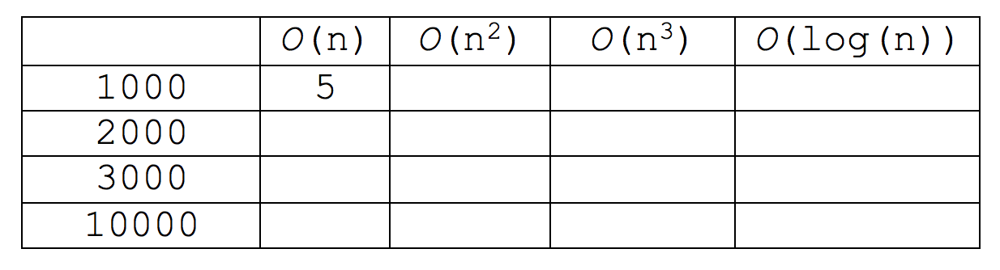

# Exercises for day 1

##Exercise 1 (measure execution time)

Open the project “Collections and Efficiency – demo”  and open the project “time_measure_demo”.

*	Run the program “MeasureSimpleCode”. Compare your observations with your neighbours.
  * What can be concluded?

*	Run with different values of ‘n’. Observe how the execution time varies with “n”.
  * Conclusion?

Note: In this project we have disabled the "Just-in-time compilation”. In NetBeans this is done by:

Right click the project > properties > Run 
set ”VM Options”  to  ”-Djava.compiler=NONE” > OK

##Exercise 2 (another “algorithm”)

Now, add the statement below to the loop in exercise 1 and figure out how execution time varies with “n” after the change.
```java
n = n/2;
```
Conclusion?

##Exercise 3 (Time complexity – ‘Big O’ – notation)

Determine the time complexity for the following code fragments.
Use the ’Big O’-notation in your answers. ‘n’ is assumed to be declared and initialized.

```java
  for (int i=0;i<10000;i++)
     	Math.sqrt(i);
```	
```java
for (int i=0;i<n;i++)
	    Math.sqrt(i);		
```

```java
while(1<n)
{
     n=n/2;
     Math.sqrt(n);	
}
```

```java
for (int i=0; i<n; i++)
{
   for (int k=i; k<n; k++)
   {
        Math.sqrt(i);
   }
}
```
##Exercise 4 (Time complexity)

What is the time growth rate (time complexity) of the following method?

```java
public static int count(int[] a, int c)
{
  int count = 0;
  for (int i = 0; i < a.length; i++)
  {
      if (a[i] == c) count++;
  } 
   return count; 
 }
 ```
 
##Exercise 5 (Time complexity)

Suppose an algorithm A takes 5 seconds to handle a dataset of 1000 elements. Fill in the approximate execution time for A depending on the complexity of the algorithm.


##Exercise 6 (Time complexity)

For the following expressions, what is the order of growth (time complexity) of each?

1.	n<sup>2</sup>+ 2n + 1
2.	n<sup>10</sup> + 9n<sup>9</sup> + 20n<sup>8</sup> + 145n<sup>7</sup>
3.	n + (0.001)n<sup>3</sup>
4.	n + log(n)

##Exercise 7 (classic search algorithms)

1.	Run the program  “MeasureAlgorithm” several times with varying values for both ‘n’ and ‘target’.

 What can you conclude about the expected execution time and its dependence on ‘n’ and ‘target’ ?

2.	Use  “BinarySearch” and repeat.

3.	Create a class called SortingAlgorithms. This class should have an array of integer as a datafield and array size. The constructor should be used to create an array of given size. SortingAlgorithms class should have three methods. One method for filling the array with random integers which you can call from the constructor.
One method for implementing inserstion sort, One method for selection sort. In the main method you create three objects with array size of 100,1000, and 10000. Identify the elapsed times when selection and insertion methods are called. What are the time complexities? Does your observation match with actual elapsed time?

##Exercise 8 (LinkedList and ArrayList)

###a) 
Draw a memory referencing diagram of adding three nodes in a LinkedList of nodes 26, 13, 180, 30. 


###b) 
Make a “benchmark”-test between ArrayList and LinkedList.
Create an ArrayList and a LinkedList and fill both with ‘n’ Integers. Then measure the execution time on both lists for several calls to 
```java
add(index, 1) 
```
where ‘index’ refers to the first, the middle and the last element respectively

Draw relevant conclusions from your observations: Describe a situation where you would prefer a LinkedList rather than an ArrayList?

Hint: Remember to disable the "Just-in-time compilation” – see exercise 1.


###c)
Measure actual execution times for sorting a large number of elements in ArrayLists and LinkedLists using the method Collecions.sort().

Hint: Take care to include only the sorting code in the actual measurement.

Hint2: Read the documentation for the implementation of the sort() method. In some versions of Java, the list is copied to an array before sorting. What does this imply for the execution times?  


