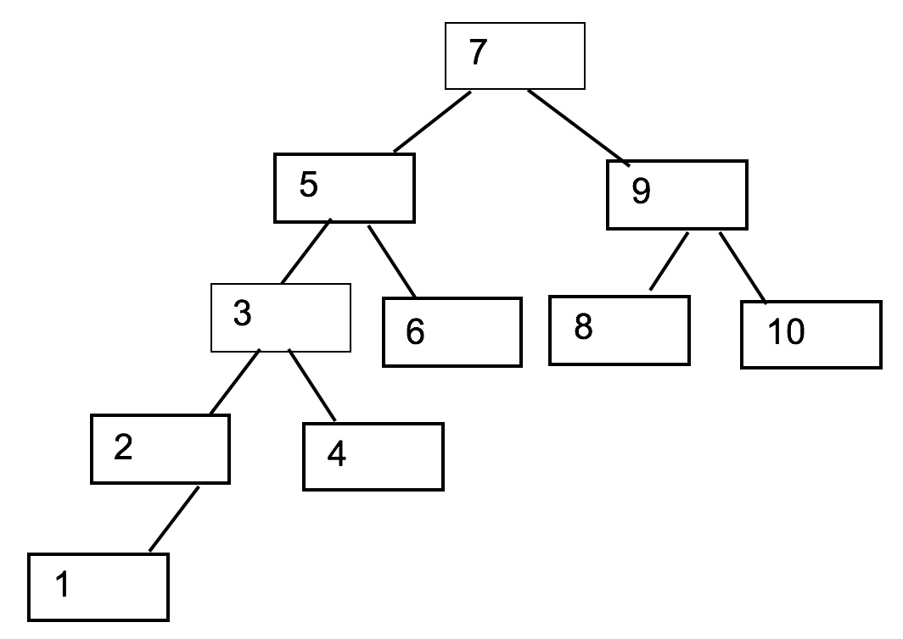

#Day2 Exercises - binary trees and recursion

##Exercise B -Recursion

2. Solve the exercises factorial, bunnyEars, bunnyEars2, triangle from <http://codingbat.com/java/Recursion-1>

##Exercise C -Binary trees
3. Go to <https://www.cs.usfca.edu/~galles/visualization/BST.html> and play a bit with the animation. 
  Insert a few elements. Find an element, Delete an element.
4. Sketch a binary search tree (on paper) after the insertion of the numbers [ 5,3,2,6,8,9,10 ] in the order shown. 
   Assume that the tree was empty initially.
5. Sketch a (new) binary search tree after insertion of the numbers  [ -1,10,-50,-20,50,4,5,6 ].
6. Sketch a (new) binary search tree after insertion of the numbers [ 1,2,3,4,5,6 ]
7. Order the insertion of the numbers [1,2,3,4,5,6,7 ] into a tree, so that the 
resulting tree will have the minimal height possible.
8. Go to <https://www.khanacademy.org/computer-programming/depth-first-traversals-of-binary-trees/934024358>. Try to figure out what is the difference between traversing the tree in Preorder, Inorder and Postorder.
9. State the order in which the nodes will be visited if the tree from exercise 4 is traversed following the principle inorder, preorder and postorder principle respectively. 
10. Which of the three traversals writes out the elements in sorted order?

   
11. Get the code from the project BinarySearchTreeDemo to run in Netbeans.

  * Create the tree below using a sequence of to the insert menthod:

  

11. Check that the lookup method works. Test with both an element which exist in the tree, and one which do not.
