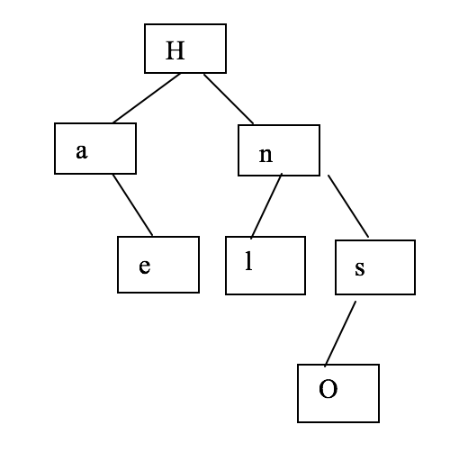

#Studypoint exercise - collection & algorithms

## Handin: Sunday September 25th at 23:59
As before, send your handin to **aflevering2sem@gmail.com**

This exercise should be solved and handed in in pairs (two persons). Remember to put both names in the hand-in email.

**Handin should be a single pdf document, written in English (not Welch)**.

##Problem 1

What is the time complexity (growth rate) for the following method expressed  in ”Big O” notation? 

```java
public void doFoo(int n)
{
	int pass = 1;
	while (pass <= n)
	{
		for (int index = 0; index < n; index++)
    	{
	   	 	for (int count = 1; count < 10; count++)
       	 	{
	 	      if (arr1[pass] == arr2[index])
              arr1[pass]++;
       		} 
    	} 
    	pass = pass + 1;
	}
}
```

##Problem 2

Write a method 

```java
public void freq(int[] arr)
```
where _arr_ is an array of positive integers. For example:

```java
[ 2,5,2,9,7,1,100,2,3,5,77,9,1,2,6,5]
```

The method must print out a table showing how many times each integer from the array appears in the array. The table must be sorted by the integers.  

Ex: 
<table>
	<tr><td>1</td><td>3</td>
	<tr><td>2</td><td>4</td>
	<tr><td>3</td><td>1</td>
	<tr><td>5</td><td>3</td>
</table>

Test the method with different sets of integers.
Hint: Use JCF (Java Collection Framework) to get the most simple solution.

**In the hand in**: The java code (the method) and  documentation for the test.

##Problem 3

Provide arguments for which class(es) from the Java Collection Framework you would choose for an application for which the typical use is expected to be an alternation between  
	
* Frequent insertions of elements with unique id's
* Frequent searches/look ups

while sorting is not needed

**In the hand in**: The choice and the arguments.

##Problem 4

Suppose we insert the first 7 different letters in your name (first name and last name) in a binary search tree (empty from start) – one letter at a time.

###a)
Make a sketch of the resulting tree. 


Ex. If your name is Hans Olsen, the tree would be like this :



Assume that we in the tree for "Hans Olsen" (as shown above) do the following: Insert "'b" and then delete the "H".

###b)
Make a sketch of the resulting tree.

Hint: Search on the Internet for an algorithm for deleting an element in a binary search tree. [This video](https://www.youtube.com/watch?v=82cIlfCkCCw) shows a number of deletes using the tool we used on day2

**Hand in**: The 2 sketches (you are welcome to hand-draw, take a photo, and add the picture to the document).

##Problem  5

Use the class [BinarySearchTree.java](BinarySearchTree.java) (i.e. NOT the one from classes, but the one behind the link). Assume that the tree contains Integers .

Write a new recursive method that calculates the sum of all elements in a (sub)tree of a given node as root

```java
private int sumRec (BinaryTreeNode node)
```

Hint1: The method must be started by another non recursive method (as in the code from class on day 2)

```java
public int sum()
```

Hint2: A type cast to (int) is necessary before adding elements from the tree (Comparable) 

**Hand in**: The Java code for both methods.

##Porblem 6 (Extra – for the quick, not mandatory) 

Use the same class as in exercise 5 ( [BinarySearchTree.java](BinarySearchTree.java) ).

Write a recursive method that concatenates and returns a String with all the elements in the tree - "preorder" 

Write also a public method that can be called from outside the class.

**Hand in**: The Java code for both methods.
